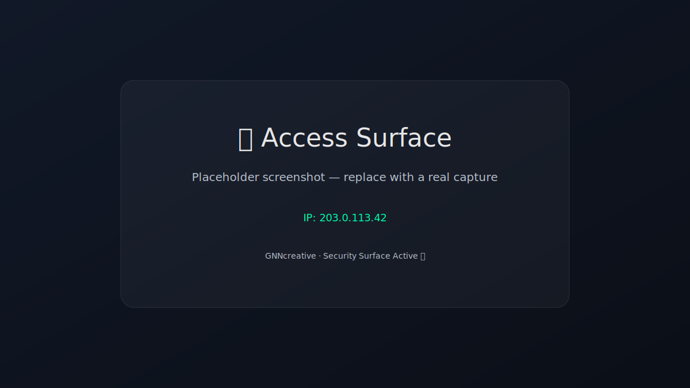

# 🚫 Access Surface (WordPress Decoy Page)


A lightweight, bilingual (TR/EN) decoy page for WordPress endpoints that are commonly scanned or attacked:

- `/wp-login.php`
- `/wp-admin`
- `/xmlrpc.php`

Instead of exposing your real login endpoint, this page provides a **monitored security surface** with a bit of psychological deterrence.

---

## ✨ Features

- 🌍 Automatic language detection (Turkish / English)
- 🛡 Security-oriented messaging
- 🌐 Visitor IP display (client-side)
- 🎨 Minimal cyber-style UI
- 🚫 SEO excluded (`noindex, nofollow`)
- 📦 Minified & lightly obfuscated JS/CSS
- ⚡ Works great with Cloudflare Redirect / WAF rules

---

## 🖼 Screenshot

> Replace the placeholder with a real screenshot after deployment.



---

## 📂 Repository Structure

```
access-surface/
├── nope_page/
│   ├── index.html
│   ├── style.min.css
│   └── app.min.js
├── assets/
│   └── screenshot.svg
├── LICENSE
└── README.md
```

---

## 🚀 Quick Start

1) Upload the `nope_page/` folder to your server, for example:

```
/public_html/nope/
```

2) Open:

```
https://yourdomain.com/nope/
```

---

## 🔁 Redirect Setup (Recommended)

### ✅ Cloudflare (Best Practice)

Create a **Redirect Rule**:

**Condition (expression):**

```
(http.request.uri.path contains "/wp-login.php"
 or http.request.uri.path starts_with "/wp-admin")
```

**Action:**

- **302 Redirect** → `https://yourdomain.com/nope/`

Optional hardening:
- Add **Managed Challenge** on `/wp-login.php` & `/wp-admin`
- Add **Rate Limiting** on `/wp-login.php` (POST)
- **Block** `/xmlrpc.php` (if you don’t need it)

---

## 🔐 Important Note

Client-side code can always be viewed via browser DevTools.  
This project uses minification and light obfuscation to reduce readability, **not** to provide real secrecy.

Real protection should rely on:
- Cloudflare WAF / Bot protection
- Rate limiting
- Custom admin URL
- Server-side allowlists (where possible)

---

## 📄 License

MIT — see [`LICENSE`](LICENSE).

---

## 🛡 Author

**GNNcreative**  
Security Surface Active 🛡️
